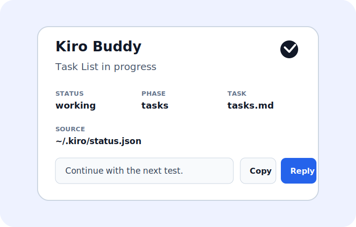

# Kiro Hook Setup

Kiro Buddy watches a local `status.json` file. The helper script in this repo writes that file in the payload shape the desktop pet expects.

Default status paths:

```text
Windows: %USERPROFILE%\.kiro\status.json
macOS:   ~/.kiro/status.json
```

Override it if needed on Windows:

```powershell
$env:KIRO_BUDDY_STATUS_FILE="C:\Users\you\.kiro\status.json"
```

Override it if needed on macOS:

```bash
export KIRO_BUDDY_STATUS_FILE="$HOME/.kiro/status.json"
```

## Recommended IDE Hooks

For published installs, open any Kiro workspace and run:

```bash
npx -y @jagatees/kiro-buddy install
npx -y @jagatees/kiro-buddy start
```

For local development from this repo, run from `kiro-buddy`:

```bash
npm run hooks:install
```

Restart Kiro or click the hooks refresh button if the new hooks do not appear immediately. The installer writes machine-specific hook files to the current workspace's `.kiro/hooks` folder, writes Buddy slash agents to `.kiro/agents`, and copies the small status runner to `.kiro/kiro-buddy`.

## Kiro CLI Setup

Kiro CLI supports hooks in agent JSON configs. Buddy installs a local CLI agent config at `.kiro/agents/kiro-buddy-cli.json`.
It also writes a global copy to `~/.kiro/agents/kiro-buddy-cli.json` so the agent is found even when you launch `kiro-cli` from a parent folder or another project directory.

For published installs:

```bash
npx -y @jagatees/kiro-buddy cli install
kiro-cli chat --agent kiro-buddy-cli
```

For local development:

```bash
npm run cli-hooks:install
kiro-cli chat --agent kiro-buddy-cli
```

The CLI agent config wires Buddy to these Kiro CLI hook events:

- `agentSpawn` opens Buddy.
- `userPromptSubmit` switches Buddy to working and records prompt context.
- `preToolUse` switches Buddy to asking when Kiro CLI is waiting for tool approval.
- `postToolUse` keeps Buddy in working during tool activity.
- `stop` switches Buddy to done.

You can also control Buddy directly from any terminal:

```bash
npx -y @jagatees/kiro-buddy cli open
npx -y @jagatees/kiro-buddy cli close
npx -y @jagatees/kiro-buddy cli test
npx -y @jagatees/kiro-buddy cli status working
```

The installer creates:

- `/buddy-open` to open Buddy from Kiro's input box
- `/buddy-close` to close Buddy from Kiro's input box
- `/buddy-test` to cycle every visual state for manual QA
- `Kiro Buddy Working` for Prompt Submit
- `Kiro Buddy Asking For Input` for Kiro user-input prompts
- `Kiro Buddy Spec Activity` for phase-specific spec file/tool activity
- `Kiro Buddy Done` for Agent Stop
- `Kiro Buddy Error Test` as a manual test hook

`Kiro Buddy Working` keeps Buddy on the working/laptop animation while Kiro is doing normal agent work. The asking animation is reserved for the asking hook and manual asking test, so it should only appear when Kiro is waiting for user input or approval.

The installer also adds narrow workspace trusted-command entries for the copied Kiro Buddy status script and local Buddy CLI. This lets Kiro run Buddy hooks and slash commands immediately instead of pausing on a `Run` approval prompt for the Buddy command itself. If a user-level command denylist still blocks the command, use Kiro's `Run and Trust` button once for the Buddy hook command or adjust `Kiro Agent: Command Denylist`.

The desktop app also watches Kiro's own IDE logs for `inputRequired` notifications. This catches command approval prompts that happen between normal hook events, such as a terminal command waiting on `Run` or `Trust`. When that signal appears, Buddy switches to the asking animation even if the last hook event was `Kiro Buddy Working`.

## Buddy Panel And Replies

Click Buddy's round down button to open the compact panel. It shows the current status, detected spec phase, last update time, watched `status.json` path, and the last Buddy slash command recorded by `/buddy-open` or `/buddy-close`.

The panel reply box has three controls:

- `Text` fills in a short suggested reply for the current state.
- `Next` fills in `Continue with the next test.` for the common test loop.
- `Copy` copies the reply text to the clipboard on every platform.
- `Reply` copies the reply text and, on macOS, tries to activate Kiro, paste it, and press Return. macOS may ask for Accessibility permission the first time. If automation is blocked, the text is still copied so you can paste it manually.

The reply dropdown stores the last five unique replies locally in `~/.kiro-buddy/reply-history.json`.



## Open And Close Reliability

Buddy has three supported open paths:

- `/buddy-open` from Kiro
- `npx -y @jagatees/kiro-buddy open`
- `npx -y @jagatees/kiro-buddy on`

Buddy has three supported close paths:

- `/buddy-close` from Kiro
- `npx -y @jagatees/kiro-buddy close`
- `npx -y @jagatees/kiro-buddy off`

Close writes a local manual-close marker in `~/.kiro-buddy/manual-close.json`. Open always clears that marker before launching Buddy again, then writes an idle status update. `/buddy-test` also clears the marker before starting the visual state cycle.

If Buddy does not come back after a close, run:

```bash
npx -y @jagatees/kiro-buddy open
```

Then reload Kiro and retry `/buddy-open` if the slash command itself is stale.

Manual setup is also supported:

Create shell-command hooks in Kiro's Agent Hooks UI. The installer is preferred because it writes the right command for the current platform.

Windows examples:

| Kiro event | Command |
|---|---|
| Prompt Submit | `powershell.exe -NoProfile -ExecutionPolicy Bypass -File "D:\Github-Local\kiro-pets\kiro-buddy\scripts\kiro-status-hook.ps1" working` |
| Pre Tool Use | `powershell.exe -NoProfile -ExecutionPolicy Bypass -File "D:\Github-Local\kiro-pets\kiro-buddy\scripts\kiro-status-hook.ps1" asking` |
| Agent Stop | `powershell.exe -NoProfile -ExecutionPolicy Bypass -File "D:\Github-Local\kiro-pets\kiro-buddy\scripts\kiro-status-hook.ps1" done` |
| Manual Trigger | `powershell.exe -NoProfile -ExecutionPolicy Bypass -File "D:\Github-Local\kiro-pets\kiro-buddy\scripts\kiro-status-hook.ps1" idle` |

macOS examples:

| Kiro event | Command |
|---|---|
| Prompt Submit | `node "/path/to/kiro-buddy/scripts/kiro-status-hook.cjs" working` |
| Pre Tool Use | `node "/path/to/kiro-buddy/scripts/kiro-status-hook.cjs" asking` |
| Agent Stop | `node "/path/to/kiro-buddy/scripts/kiro-status-hook.cjs" done` |
| Manual Trigger | `node "/path/to/kiro-buddy/scripts/kiro-status-hook.cjs" idle` |

## macOS Fullscreen Overlay Check

Kiro Buddy uses macOS panel-window behavior, `visibleOnFullScreen`, and a high always-on-top level so it can float over normal fullscreen apps without taking focus.

Manual verification on a Mac:

1. Run `npm run build`.
2. Run `npm run hooks:install`.
3. Reload Kiro so `/buddy-open` and `/buddy-close` are rediscovered.
4. Run `/buddy-close`, then `/buddy-open` from Kiro.
5. Put a normal app such as Safari, Chrome, or Kiro into macOS fullscreen.
6. Confirm Buddy remains visible above that fullscreen app and clicking the app still leaves focus in the app.

Known macOS boundary: secure system surfaces, permission prompts, lock screens, and some protected media/fullscreen contexts may appear above all third-party overlays. Treat those as OS-level limits, not Buddy failures.

## Spec Phase Labels

The hook accepts an optional second argument for Kiro's spec-driven phases.

Windows examples:

```powershell
powershell.exe -NoProfile -ExecutionPolicy Bypass -File "D:\Github-Local\kiro-pets\kiro-buddy\scripts\kiro-status-hook.ps1" working design
powershell.exe -NoProfile -ExecutionPolicy Bypass -File "D:\Github-Local\kiro-pets\kiro-buddy\scripts\kiro-status-hook.ps1" working requirements
powershell.exe -NoProfile -ExecutionPolicy Bypass -File "D:\Github-Local\kiro-pets\kiro-buddy\scripts\kiro-status-hook.ps1" working tasks
```

macOS examples:

```bash
node "/path/to/kiro-buddy/scripts/kiro-status-hook.cjs" working design
node "/path/to/kiro-buddy/scripts/kiro-status-hook.cjs" working requirements
node "/path/to/kiro-buddy/scripts/kiro-status-hook.cjs" working tasks
```

If the second argument is omitted, the script tries to infer the phase from Kiro hook context such as `USER_PROMPT`, active file variables, or filenames like `design.md`, `requirements.md`, and `tasks.md`. Terminal states such as `done` and `error` preserve the last known phase when possible, so Buddy can show labels like `Design Done` or `Task List Error`.

The installed `Kiro Buddy Spec Activity` hook listens to Kiro `write` and `spec` tool activity and only updates Buddy when it can detect a spec phase. This prevents normal code writes from overwriting a phase-specific animation.

For error/status experiments you can run:

```bash
npm run status:error
npm run status:done
npm run status:idle
```

To verify the Kiro log input monitor end to end, start Buddy and run:

```bash
npm run smoke:input-monitor
```

The smoke test writes `working`, appends a synthetic Kiro `inputRequired` log line, and waits for Buddy to switch to `asking`.

Kiro's shell hooks pass useful context via STDIN or environment variables depending on trigger type. The helper consumes both when available and keeps messages below the app's 120-character validation limit.
